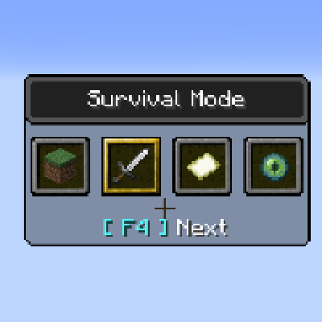

---
navigation:
  title: "Fast Gamemode Switch"
  icon: "minecraft:grass_block"
  parent: lexicon:tips_tricks.md
---

# Fast Gamemode Switch

If you want to change your gamemode in game, there is a faster way than the */gamemode* [*Command*](../commands.md): 

*F3* + *F4* opens the gamemode switcher menu. 

While holding down *F3*, a [*Player*](../creatures/human-player.md) can cycle between the game modes by pressing *F4* and enter the selected gamemode after releasing *F3*.

You need operator rights to do this.
