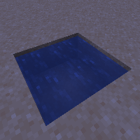

---
navigation:
  title: "Infinite Water"
  icon: "minecraft:water_bucket"
  parent: lexicon:tips_tricks.md
  item_ids:
    - minecraft:water
---

# Infinite Water

__The simplest infinite water source:__ 

- __Step 1:__ Dig a hole 1 block down, 2 blocks wide and 2 blocks long. 

- __Step 2:__ Fill in 2 opposite corners with *Water* source blocks. 

- __Step 3:__ Get a *Bucket* and take all the *Water* you want!

