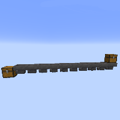
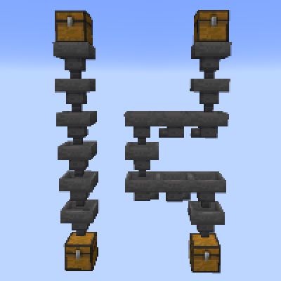
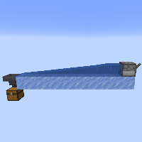
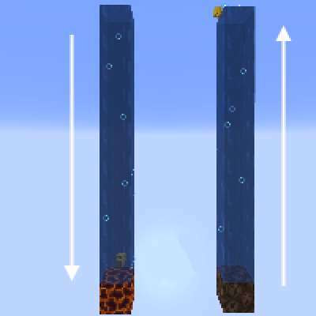
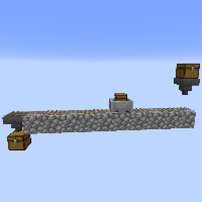

---
navigation:
  title: "Item Transportation"
  icon: "minecraft:dropper"
  parent: lexicon:tips_tricks.md
---

# Item Transportation

## Hopper

By placing a line of [*Hoppers*](../redstone/redstone_components.md#hopper) all pointing into each other, items can be transported in all directions except up. 

On large scale, [*Hoppers*](../redstone/redstone_components.md#hopper) have been known to create lag.

 

------

## Water streams

A less iron expensive method is the use of *Water* streams. This uses the mechanic of dropped items moving in flowing water streams. 

Since *Water* can only flow 7 blocks from the source, it is usually necessary to use multiple sources. To handle the breaks, a *Packed Ice* block and *Sign* can be used. When the items come out of one stream, they will slide across the ice to the next.

Water flowing on *Packed Ice* or *Blue Ice* makes the items go faster, reducing the delay.

------

## Water elevators

When a *Water* __source__ is directly above a *Magma Block*, a whirlpool bubble column is created, going downward from the highest source block. 
Anything encountering the bubble column is pulled down, including items, *Boats*, [*Players*](../creatures/human-player.md) and [*mobs*](../creatures.md). 

And *Soulsand* do the same thing upwards.

------

## Rails

Items can also be transported on *Rails*, they can be transferred into and out of *Minecart with a Chest* using [*Hoppers*](../redstone/redstone_components.md#hopper).

------

## Dropper

[*Dropper*](../redstone/redstone_components.md#dropper) transportation usually work by having a line of them pointing into each other. 

When the [*Droppers*](../redstone/redstone_components.md#dropper) are powered, items can travel to the next [*Dropper*](../redstone/redstone_components.md#dropper). 

This works in all directions.

<GameScene interactive={true} zoom={2}>
  <Block x="0" y="0" z="0" id="minecraft:chest" />
  <Block x="0" y="1" z="0" id="minecraft:dropper"p:facing="up" />
  <Block x="1" y="1" z="0" id="minecraft:cobblestone" />
  <Block x="0" y="1" z="1" id="minecraft:cobblestone" />
  <Block x="1" y="1" z="1" id="minecraft:redstone_wire"p:east="side" p:west="side" p:north="side" p:south="side" p:power="15" />
  <Block x="2" y="1" z="1" id="minecraft:cobblestone" />
  <Block x="0" y="2" z="0" id="minecraft:dropper"p:facing="up" />
  <Block x="1" y="2" z="0" id="minecraft:comparator"p:facing="north" />
  <Block x="2" y="2" z="0" id="minecraft:cobblestone" />
  <Block x="0" y="2" z="1" id="minecraft:redstone_wall_torch"p:facing="north" p:lit="false" />
  <Block x="1" y="2" z="1" id="minecraft:cobblestone" />
  <Block x="2" y="2" z="1" id="minecraft:redstone_wall_torch"p:facing="east" p:lit="true" />
  <Block x="0" y="3" z="0" id="minecraft:dropper"p:facing="up" />
  <Block x="1" y="3" z="0" id="minecraft:cobblestone" />
  <Block x="0" y="3" z="1" id="minecraft:cobblestone" />
  <Block x="1" y="3" z="1" id="minecraft:redstone_wire"p:east="side" p:west="side" p:north="side" p:south="side" p:power="15" />
  <Block x="2" y="3" z="1" id="minecraft:cobblestone" />
  <Block x="0" y="4" z="0" id="minecraft:dropper"p:facing="up" />
  <Block x="1" y="4" z="0" id="minecraft:comparator"p:facing="north" />
  <Block x="2" y="4" z="0" id="minecraft:cobblestone" />
  <Block x="0" y="4" z="1" id="minecraft:redstone_wall_torch"p:facing="north" p:lit="false" />
  <Block x="1" y="4" z="1" id="minecraft:cobblestone" />
  <Block x="2" y="4" z="1" id="minecraft:redstone_wall_torch"p:facing="east" p:lit="true" />
  <Block x="0" y="5" z="0" id="minecraft:dropper"p:facing="up" />
  <Block x="1" y="5" z="0" id="minecraft:cobblestone" />
  <Block x="0" y="5" z="1" id="minecraft:cobblestone" />
  <Block x="1" y="5" z="1" id="minecraft:redstone_wire"p:east="side" p:west="side" p:north="side" p:south="side" p:power="15" />
  <Block x="2" y="5" z="1" id="minecraft:cobblestone" />
  <Block x="0" y="6" z="0" id="minecraft:dropper"p:facing="up" />
  <Block x="1" y="6" z="0" id="minecraft:comparator"p:facing="north" />
  <Block x="2" y="6" z="0" id="minecraft:cobblestone" />
  <Block x="0" y="6" z="1" id="minecraft:redstone_wall_torch"p:facing="north" p:lit="false" />
  <Block x="1" y="6" z="1" id="minecraft:cobblestone" />
  <Block x="2" y="6" z="1" id="minecraft:redstone_wall_torch"p:facing="east" p:lit="true" />
</GameScene>

This design is a self powering item elevator.

-----

## Allays

[*Allays*](../creatures/animal-allay.md) collect and delivers items for any [*Player*](../creatures/human-player.md) that gives it something, or any [*Noteblock*](../redstone/redstone_components.md#noteblock) it hears.

<GameScene zoom={5} interactive={true}>
  <Entity id="minecraft:allay" />
</GameScene>

