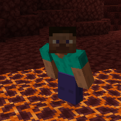
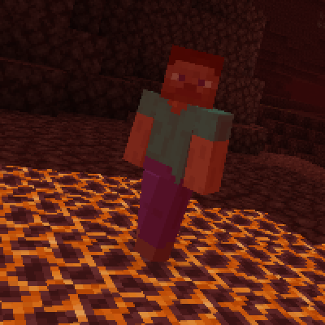

---
navigation:
  title: "Magma Block Damage"
  icon: "minecraft:magma_block"
  parent: lexicon:tips_tricks.md
---

# Magma Block Damage

*Magma Blocks* damage most living entities standing on top of them, even if underwater. 

The [*Player*](../creatures/human-player.md) can avoid all damage by sneaking, being under the [*Fire Resistance*](../brewing/effect.md#fire_resistance) effect, or by wearing [*Frost Walker*](../enchanting/enchantments.md#frost_walker) *Boots*.

TODO: Unsupported flag 'border'

