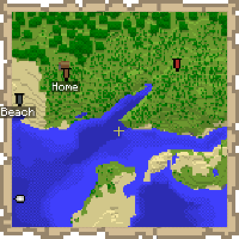

---
navigation:
  title: "Map Marker"
  icon: "minecraft:filled_map"
  parent: lexicon:tips_tricks.md
---

# Map Marker

Using on a *Banner* with a *Map* selected places a marker of the banner's position on the selected *Map*, and using on the *Banner* again removes the marker. 

The marker has the same color as the banner. 

The marker is removed if the banner is destroyed unless the map is locked using a [*Cartography Table*](../useables/cartography_table.md).

If the banner is renamed, the name appears below the marker.

<Recipe id="minecraft:map" />

<Recipe id="minecraft:cartography_table" />

*Banners* can have different colors.

<Recipe id="minecraft:light_blue_banner" />

<Recipe id="minecraft:red_banner" />

