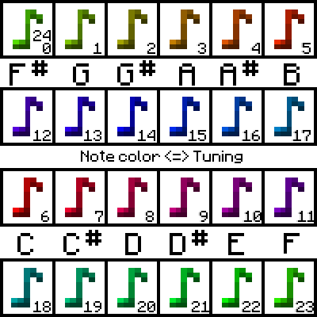

---
navigation:
  title: "Note Blocks"
  icon: "minecraft:note_block"
  parent: lexicon:tips_tricks.md
  item_ids:
    - minecraft:noteblock
---

# Note Blocks

[*Note Blocks*](../redstone/redstone_components.md#noteblock) play a musical note when hit or powered by [*Redstone*](../redstone/redstone_behavior.md). 

A [*Note Block*](../redstone/redstone_components.md#noteblock) must have air in the space directly above it to play a sound. 

Pressing the use button on the block increases the note pitch up a semitone.

The tuning can also be checked by looking on the right side of the debug screen (pressing *F3*)

-----

The instrument played depends on the material of the block underneath the *Note Block*: 

- **Wood** = Bass 
- **Sand/Gravel** = Snare Drum 
- **Glass** = Clicks & Sticks 
- **Stone type** = Bass Drum 
- **Gold Block** = Bells 
- **Clay/Honeycomp** = Flute 
- **Packed Ice** = Chimes 
- **Wool** = Guitar 
- **Bone Block** = Xylophone 
- **Iron Block** = Iron Xylophone 
- **Soul Sand** = Cow Bell
- **Pumpkin** = Didgeridoo 
- **Emerald Block** = Bit 
- **Hay Bale** = Banjo 
- **Glowstone** = Pling 
- **all other** = Harp / Piano 

Placing a [*Head*](../rare/mob_head.md) __above__ a note block causes the block to play the corresponding [*mob*](../creatures.md)'s sound when activated.

