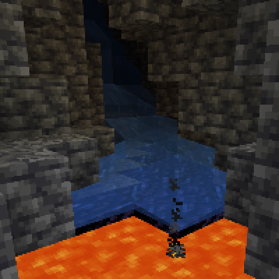

---
navigation:
  title: "Obsidian Generation"
  icon: "minecraft:obsidian"
  parent: lexicon:tips_tricks.md
---

# Obsidian Generation

*Obsidian* is formed when *Flowing Water* touches a *Lava Source* block, and can be found naturally where *Water* from a spring or lake has flowed over a nearby *Lava* pool.

