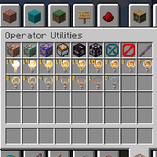
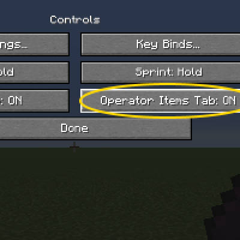

---
navigation:
  title: "Operator Items"
  icon: "minecraft:command_block"
  parent: lexicon:tips_tricks.md
---

# Operator Items

In the operator utilities you will find functional items and blocks that are primarily intended for server owners, creators, mapmakers or experienced users. 

They are only accessible via the **/give** [*Command*](../commands.md) or in the creative inventory by activating it at __*options/controls/operator item tab*__.

 

-----

__Operator Utilities:__ 

- [*Command Blocks*](../redstone/redstone_components.md#command_block): Can execute commands 

- [*Structure Blocks*](../redstone/redstone_components.md#structure_block): Can export, import or save structures 

- *Light Blocks*: A invisible light source 

- *Barrier Block*: A invisible indestructible barrier

- *Debug Stick*: A tool for changing block states

