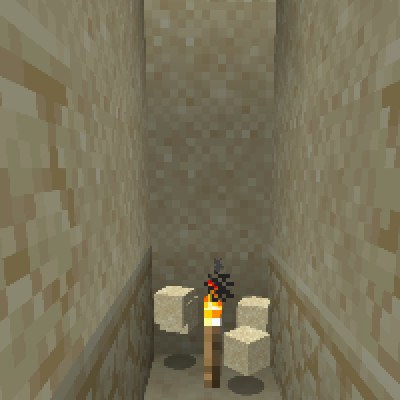

---
navigation:
  title: "Fast Sand farming"
  icon: "minecraft:sand"
  parent: lexicon:tips_tricks.md
---

# Fast Sand farming

Gravity blocks such as *Sand* or *Gravel* can be farmed quickly in large quantities by breaking down the bottom block and then __quickly__ setting a *Torch*. 

That causes all falling blocks to drop.

TODO: Unsupported flag 'border'

