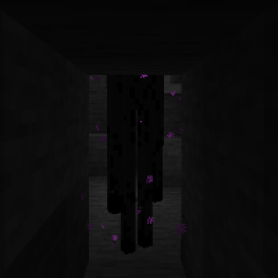

---
navigation:
  title: "Save Holes"
  icon: "minecraft:stone"
  parent: lexicon:tips_tricks.md
---

# Save Holes

Some monsters can be tricked by hiding in a hole smaller than your opponent's and attacking them from there. 

But you can also build your way up until the opponent can no longer reach you.

