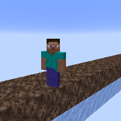

---
navigation:
  title: "Slowing Blocks"
  icon: "minecraft:soul_sand"
  parent: lexicon:tips_tricks.md
  item_ids:
    - minecraft:soul_sand
    - minecraft:mud
---

# Slowing Blocks

*Soul Sand* usually slows down the movement of mobs and [*Players*](../creatures/human-player.md) walking on it. 

This slowing effect can be increased by placing *Soul Sand* directly on any *Ice Block* or *Slime Blocks*.

