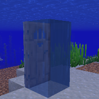

---
navigation:
  title: "Air underwater"
  icon: "minecraft:water_bucket"
  parent: lexicon:tips_tricks.md
---

# Air underwater

If a *Turtle Shell* or [*Potion of Water Breathing*](../brewing/brewing.md) is not available at the moment, there's also simpler tricks to be used. 

If you place a block that is smaller than a full block underwater, air is created that you can breathe.

