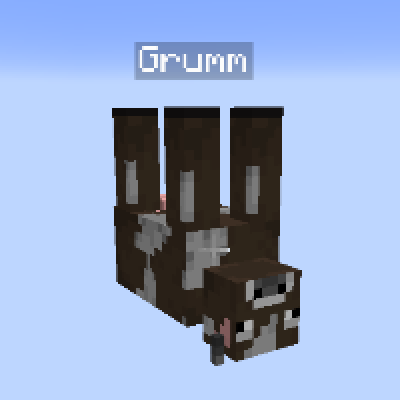

---
navigation:
  title: "Useful Nametags"
  icon: "minecraft:name_tag"
  parent: lexicon:tips_tricks.md
  item_ids:
    - minecraft:name_tag
---

# Useful Nametags

A *Name Tag* is an item used to name mobs in the world and prevent them from __despawning__ naturally.

To use a tag, it must first be renamed with an [*Anvil*](../useables/anvil.md), costing 1 experience level.

<Recipe id="minecraft:anvil" />

-----

__Easter Eggs:__ 

- Most mobs named *Dinnerbone* or *Grumm* causes it to render upside-down. 

- Naming a [*Sheep*](../creatures/animal-sheep.md) *jeb_* causes it's wool to fade between the dye colors, producing a rainbow effect. 

- Naming a [*Rabbit*](../creatures/animal-rabbit.md) *Toast* causes it to hava a special skin. 

- Naming a [*Vindicator*](../creatures/human-vindicator.md) *Johnny* causes it to be aggressive to all mobs.

