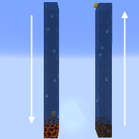

---
navigation:
  title: "Water Elevator"
  icon: "minecraft:magma_block"
  parent: lexicon:tips_tricks.md
---

# Water Elevator

When a *Water* __source__ is directly above a *Magma Block*, a whirlpool bubble column is created, going downward from the highest source block. 
Anything encountering the bubble column is pulled down, including items, *Boats*, [*Players*](../creatures/human-player.md) and mobs. 

And *Soulsand* do the same thing upwards. 

This fact makes it perfect for building an elevator, item transport system or mob trap.

TODO: Unsupported flag 'border'

