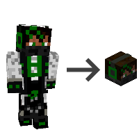

---
navigation:
  title: "Get your own Head"
  icon: "minecraft:player_head"
  parent: lexicon:tips_tricks.md
---

# Get your own Head

You can get your own [*Head*](../rare/mob_head.md) with your [*Player*](../creatures/human-player.md) skin in game with a simple [*Command*](../commands.md): 

> /give @p minecraft:player_head{SkullOwner:*PLAYER_NAME*}

