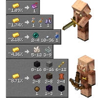

---
navigation:
  title: "Piglin Bartering"
  icon: "minecraft:gold_ingot"
  position: 3
  parent: lexicon:trading.md
---

# Piglin Bartering

To barter with a [*Piglin*](../creatures/monster-piglin.md), either throw by dropping a *Gold Ingot* near an adult [*Piglin*](../creatures/monster-piglin.md) or using it on it. After the [*Piglin*](../creatures/monster-piglin.md) takes the ingot and examines it for 6 seconds, it tosses a random item to the [*Player*](../creatures/human-player.md). 

[*Piglin Brutes*](../creatures/monster-piglin_brute.md) ignore gold. 
[*Baby Piglins*](../creatures/monster-piglin.md) take the ingot without giving anything in return, instead holding the ingot.

-----

## Piglin

<GameScene zoom={4} interactive={true}>
  <Entity id="minecraft:piglin" />
</GameScene>

## Piglin Brute

<GameScene zoom={4} interactive={true}>
  <Entity id="minecraft:piglin_brute" />
</GameScene>

