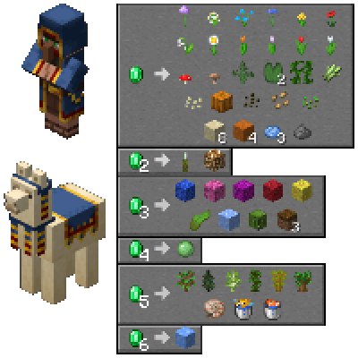

---
navigation:
  title: "Wandering Trader"
  icon: "minecraft:emerald"
  position: 2
  parent: lexicon:trading.md
---

# Wandering Trader

<GameScene zoom={4} interactive={true}>
  <Entity id="minecraft:wandering_trader" />
</GameScene>

The [*Wandering Trader*](../creatures/human-wandering_trader.md) has 6 random trades. New trades are not unlocked after trading with it.

- After the [*Player*](../creatures/human-player.md) purchases the same item several times, the wandering trader locks the trade, but unlike [*Villagers*](../creatures/human-villager.md), never unlocks the trade. 
- They do not have the novice-master trading system like [*Villagers*](../creatures/human-villager.md). Instead, the [*Player*](../creatures/human-player.md) can buy anything from the trader without the need of unlocking the previous trades. 
- They do not increase or decrease the prices of its items being sold if attacked by the player, ...

