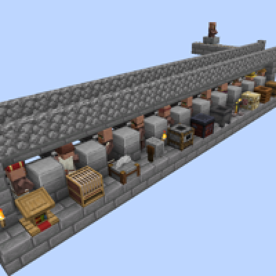
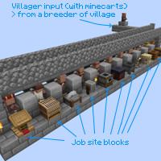
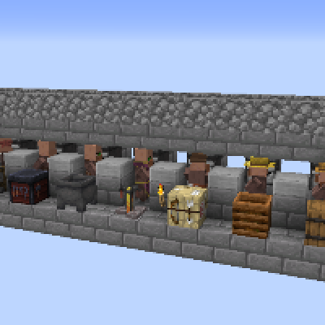
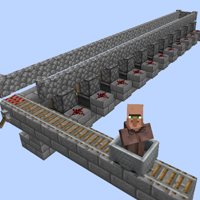

---
navigation:
  title: "Trading Hall"
  icon: "minecraft:lectern"
  position: 4
  parent: lexicon:trading.md
---

# Trading Hall

Villager trading halls maximize the number of [*Villagers*](../creatures/human-villager.md) that can be easily reached. 

You can easily change the jobs and thus the trades of the [*Villagers*](../creatures/human-villager.md) with the job site blocks.

   

-----

<GameScene interactive={true} zoom={2}>
  <Block x="0" y="0" z="1" id="minecraft:cobblestone_wall"p:east="low" p:north="none" p:south="none" p:west="none" p:up="true" />
  <Block x="1" y="0" z="1" id="minecraft:activator_rail"p:shape="north_south" p:powered="true" />
  <Block x="2" y="0" z="1" id="minecraft:rail"p:shape="north_south" />
  <Block x="3" y="0" z="1" id="minecraft:rail"p:shape="north_south" />
  <Block x="0" y="0" z="2" id="minecraft:cobblestone_wall"p:east="low" p:north="none" p:south="none" p:west="low" p:up="false" />
  <Block x="2" y="0" z="2" id="minecraft:cobblestone_wall"p:east="low" p:north="none" p:south="none" p:west="none" p:up="true" />
  <Block x="0" y="0" z="3" id="minecraft:cobblestone_wall"p:east="low" p:north="none" p:south="none" p:west="low" p:up="false" />
  <Block x="2" y="0" z="3" id="minecraft:cobblestone_wall"p:east="low" p:north="none" p:south="none" p:west="low" p:up="false" />
  <Block x="0" y="0" z="4" id="minecraft:cobblestone_wall"p:east="low" p:north="none" p:south="none" p:west="low" p:up="false" />
  <Block x="2" y="0" z="4" id="minecraft:cobblestone_wall"p:east="low" p:north="none" p:south="none" p:west="low" p:up="false" />
  <Block x="0" y="0" z="5" id="minecraft:cobblestone_wall"p:east="low" p:north="none" p:south="none" p:west="low" p:up="false" />
  <Block x="2" y="0" z="5" id="minecraft:cobblestone_wall"p:east="low" p:north="none" p:south="none" p:west="low" p:up="false" />
  <Block x="0" y="0" z="6" id="minecraft:cobblestone_wall"p:east="low" p:north="none" p:south="none" p:west="low" p:up="false" />
  <Block x="2" y="0" z="6" id="minecraft:cobblestone_wall"p:east="low" p:north="none" p:south="none" p:west="low" p:up="false" />
  <Block x="0" y="0" z="7" id="minecraft:cobblestone_wall"p:east="low" p:north="none" p:south="none" p:west="low" p:up="false" />
  <Block x="2" y="0" z="7" id="minecraft:cobblestone_wall"p:east="low" p:north="none" p:south="none" p:west="low" p:up="false" />
  <Block x="0" y="0" z="8" id="minecraft:cobblestone_wall"p:east="low" p:north="none" p:south="none" p:west="low" p:up="false" />
  <Block x="2" y="0" z="8" id="minecraft:cobblestone_wall"p:east="low" p:north="none" p:south="none" p:west="low" p:up="false" />
  <Block x="0" y="0" z="9" id="minecraft:cobblestone_wall"p:east="low" p:north="none" p:south="none" p:west="low" p:up="false" />
  <Block x="2" y="0" z="9" id="minecraft:cobblestone_wall"p:east="low" p:north="none" p:south="none" p:west="low" p:up="false" />
  <Block x="0" y="0" z="10" id="minecraft:cobblestone_wall"p:east="low" p:north="none" p:south="none" p:west="low" p:up="false" />
  <Block x="2" y="0" z="10" id="minecraft:cobblestone_wall"p:east="low" p:north="none" p:south="none" p:west="low" p:up="false" />
  <Block x="0" y="0" z="11" id="minecraft:cobblestone_wall"p:east="low" p:north="none" p:south="none" p:west="low" p:up="false" />
  <Block x="2" y="0" z="11" id="minecraft:cobblestone_wall"p:east="low" p:north="none" p:south="none" p:west="low" p:up="false" />
  <Block x="0" y="0" z="12" id="minecraft:cobblestone_wall"p:east="low" p:north="none" p:south="none" p:west="low" p:up="false" />
  <Block x="2" y="0" z="12" id="minecraft:cobblestone_wall"p:east="low" p:north="none" p:south="none" p:west="low" p:up="false" />
  <Block x="0" y="0" z="13" id="minecraft:cobblestone_wall"p:east="low" p:north="none" p:south="none" p:west="low" p:up="false" />
  <Block x="2" y="0" z="13" id="minecraft:cobblestone_wall"p:east="low" p:north="none" p:south="none" p:west="low" p:up="false" />
  <Block x="0" y="0" z="14" id="minecraft:cobblestone_wall"p:east="low" p:north="none" p:south="none" p:west="low" p:up="false" />
  <Block x="2" y="0" z="14" id="minecraft:cobblestone_wall"p:east="low" p:north="none" p:south="none" p:west="low" p:up="false" />
  <Block x="0" y="0" z="15" id="minecraft:cobblestone_wall"p:east="low" p:north="none" p:south="none" p:west="low" p:up="false" />
  <Block x="2" y="0" z="15" id="minecraft:cobblestone_wall"p:east="low" p:north="none" p:south="none" p:west="low" p:up="false" />
  <Block x="0" y="0" z="16" id="minecraft:cobblestone_wall"p:east="low" p:north="none" p:south="none" p:west="low" p:up="false" />
  <Block x="2" y="0" z="16" id="minecraft:cobblestone_wall"p:east="low" p:north="none" p:south="none" p:west="low" p:up="false" />
  <Block x="0" y="0" z="17" id="minecraft:cobblestone_wall"p:east="low" p:north="none" p:south="none" p:west="low" p:up="false" />
  <Block x="2" y="0" z="17" id="minecraft:cobblestone_wall"p:east="low" p:north="none" p:south="none" p:west="low" p:up="false" />
  <Block x="0" y="0" z="18" id="minecraft:cobblestone_wall"p:east="low" p:north="none" p:south="none" p:west="low" p:up="false" />
  <Block x="2" y="0" z="18" id="minecraft:cobblestone_wall"p:east="low" p:north="none" p:south="none" p:west="low" p:up="false" />
  <Block x="0" y="0" z="19" id="minecraft:cobblestone_wall"p:east="low" p:north="none" p:south="none" p:west="low" p:up="false" />
  <Block x="2" y="0" z="19" id="minecraft:cobblestone_wall"p:east="low" p:north="none" p:south="none" p:west="low" p:up="false" />
  <Block x="0" y="0" z="20" id="minecraft:cobblestone_wall"p:east="low" p:north="none" p:south="none" p:west="low" p:up="false" />
  <Block x="2" y="0" z="20" id="minecraft:cobblestone_wall"p:east="low" p:north="none" p:south="none" p:west="low" p:up="false" />
  <Block x="0" y="0" z="21" id="minecraft:cobblestone_wall"p:east="low" p:north="none" p:south="none" p:west="low" p:up="false" />
  <Block x="2" y="0" z="21" id="minecraft:cobblestone_wall"p:east="low" p:north="none" p:south="none" p:west="low" p:up="false" />
  <Block x="0" y="0" z="22" id="minecraft:cobblestone_wall"p:east="low" p:north="none" p:south="none" p:west="low" p:up="false" />
  <Block x="2" y="0" z="22" id="minecraft:cobblestone_wall"p:east="low" p:north="none" p:south="none" p:west="low" p:up="false" />
  <Block x="0" y="0" z="23" id="minecraft:cobblestone_wall"p:east="low" p:north="none" p:south="none" p:west="low" p:up="false" />
  <Block x="2" y="0" z="23" id="minecraft:cobblestone_wall"p:east="low" p:north="none" p:south="none" p:west="low" p:up="false" />
  <Block x="0" y="0" z="24" id="minecraft:cobblestone_wall"p:east="none" p:north="none" p:south="low" p:west="low" p:up="true" />
  <Block x="1" y="0" z="24" id="minecraft:cobblestone_wall"p:east="none" p:north="low" p:south="low" p:west="none" p:up="false" />
  <Block x="2" y="0" z="24" id="minecraft:cobblestone_wall"p:east="none" p:north="low" p:south="none" p:west="low" p:up="true" />
  <Block x="1" y="1" z="0" id="minecraft:lever"p:facing="west" p:powered="true" p:face="wall" />
  <Block x="1" y="1" z="1" id="minecraft:stone_bricks" />
  <Block x="2" y="1" z="1" id="minecraft:stone_bricks" />
  <Block x="3" y="1" z="1" id="minecraft:stone_bricks" />
  <Block x="1" y="1" z="2" id="minecraft:stone_bricks" />
  <Block x="1" y="1" z="3" id="minecraft:stone_brick_stairs"p:facing="south" p:half="top" p:shape="straight" />
  <Block x="2" y="1" z="3" id="minecraft:sticky_piston"p:facing="north" />
  <Block x="3" y="1" z="3" id="minecraft:redstone_wire"p:north="side" p:east="side" p:south="side" p:west="side" />
  <Block x="1" y="1" z="4" id="minecraft:stone_brick_stairs"p:facing="south" p:half="top" p:shape="straight" />
  <Block x="1" y="1" z="5" id="minecraft:stone_brick_stairs"p:facing="south" p:half="top" p:shape="straight" />
  <Block x="2" y="1" z="5" id="minecraft:sticky_piston"p:facing="north" />
  <Block x="3" y="1" z="5" id="minecraft:redstone_wire"p:north="side" p:east="side" p:south="side" p:west="side" />
  <Block x="1" y="1" z="6" id="minecraft:stone_brick_stairs"p:facing="south" p:half="top" p:shape="straight" />
  <Block x="1" y="1" z="7" id="minecraft:stone_brick_stairs"p:facing="south" p:half="top" p:shape="straight" />
  <Block x="2" y="1" z="7" id="minecraft:sticky_piston"p:facing="north" />
  <Block x="3" y="1" z="7" id="minecraft:redstone_wire"p:north="side" p:east="side" p:south="side" p:west="side" />
  <Block x="1" y="1" z="8" id="minecraft:stone_brick_stairs"p:facing="south" p:half="top" p:shape="straight" />
  <Block x="1" y="1" z="9" id="minecraft:stone_brick_stairs"p:facing="south" p:half="top" p:shape="straight" />
  <Block x="2" y="1" z="9" id="minecraft:sticky_piston"p:facing="north" />
  <Block x="3" y="1" z="9" id="minecraft:redstone_wire"p:north="side" p:east="side" p:south="side" p:west="side" />
  <Block x="1" y="1" z="10" id="minecraft:stone_brick_stairs"p:facing="south" p:half="top" p:shape="straight" />
  <Block x="1" y="1" z="11" id="minecraft:stone_brick_stairs"p:facing="south" p:half="top" p:shape="straight" />
  <Block x="2" y="1" z="11" id="minecraft:sticky_piston"p:facing="north" />
  <Block x="3" y="1" z="11" id="minecraft:redstone_wire"p:north="side" p:east="side" p:south="side" p:west="side" />
  <Block x="1" y="1" z="12" id="minecraft:stone_brick_stairs"p:facing="south" p:half="top" p:shape="straight" />
  <Block x="1" y="1" z="13" id="minecraft:stone_brick_stairs"p:facing="south" p:half="top" p:shape="straight" />
  <Block x="2" y="1" z="13" id="minecraft:sticky_piston"p:facing="north" />
  <Block x="3" y="1" z="13" id="minecraft:redstone_wire"p:north="side" p:east="side" p:south="side" p:west="side" />
  <Block x="1" y="1" z="14" id="minecraft:stone_brick_stairs"p:facing="south" p:half="top" p:shape="straight" />
  <Block x="1" y="1" z="15" id="minecraft:stone_brick_stairs"p:facing="south" p:half="top" p:shape="straight" />
  <Block x="2" y="1" z="15" id="minecraft:sticky_piston"p:facing="north" />
  <Block x="3" y="1" z="15" id="minecraft:redstone_wire"p:north="side" p:east="side" p:south="side" p:west="side" />
  <Block x="1" y="1" z="16" id="minecraft:stone_brick_stairs"p:facing="south" p:half="top" p:shape="straight" />
  <Block x="1" y="1" z="17" id="minecraft:stone_brick_stairs"p:facing="south" p:half="top" p:shape="straight" />
  <Block x="2" y="1" z="17" id="minecraft:sticky_piston"p:facing="north" />
  <Block x="3" y="1" z="17" id="minecraft:redstone_wire"p:north="side" p:east="side" p:south="side" p:west="side" />
  <Block x="1" y="1" z="18" id="minecraft:stone_brick_stairs"p:facing="south" p:half="top" p:shape="straight" />
  <Block x="1" y="1" z="19" id="minecraft:stone_brick_stairs"p:facing="south" p:half="top" p:shape="straight" />
  <Block x="2" y="1" z="19" id="minecraft:sticky_piston"p:facing="north" />
  <Block x="3" y="1" z="19" id="minecraft:redstone_wire"p:north="side" p:east="side" p:south="side" p:west="side" />
  <Block x="1" y="1" z="20" id="minecraft:stone_brick_stairs"p:facing="south" p:half="top" p:shape="straight" />
  <Block x="1" y="1" z="21" id="minecraft:stone_brick_stairs"p:facing="south" p:half="top" p:shape="straight" />
  <Block x="2" y="1" z="21" id="minecraft:sticky_piston"p:facing="north" />
  <Block x="3" y="1" z="21" id="minecraft:redstone_wire"p:north="side" p:east="side" p:south="side" p:west="side" />
  <Block x="1" y="1" z="22" id="minecraft:stone_brick_stairs"p:facing="south" p:half="top" p:shape="straight" />
  <Block x="1" y="1" z="23" id="minecraft:stone_brick_stairs"p:facing="south" p:half="top" p:shape="straight" />
  <Block x="2" y="1" z="23" id="minecraft:sticky_piston"p:facing="north" />
  <Block x="3" y="1" z="23" id="minecraft:redstone_wire"p:north="side" p:east="side" p:south="side" p:west="side" />
  <Block x="1" y="1" z="24" id="minecraft:stone_bricks" />
  <Block x="1" y="2" z="2" id="minecraft:stone_bricks" />
  <Block x="1" y="2" z="3" id="minecraft:tripwire" />
  <Block x="2" y="2" z="3" id="minecraft:observer"p:facing="north" />
  <Block x="3" y="2" z="3" id="minecraft:stone_bricks" />
  <Block x="1" y="2" z="4" id="minecraft:smooth_stone_slab"p:type="bottom" />
  <Block x="2" y="2" z="4" id="minecraft:stone_bricks" />
  <Block x="1" y="2" z="5" id="minecraft:tripwire" />
  <Block x="2" y="2" z="5" id="minecraft:observer"p:facing="north" />
  <Block x="3" y="2" z="5" id="minecraft:stone_bricks" />
  <Block x="1" y="2" z="6" id="minecraft:smooth_stone_slab"p:type="bottom" />
  <Block x="2" y="2" z="6" id="minecraft:stone_bricks" />
  <Block x="1" y="2" z="7" id="minecraft:tripwire" />
  <Block x="2" y="2" z="7" id="minecraft:observer"p:facing="north" />
  <Block x="3" y="2" z="7" id="minecraft:stone_bricks" />
  <Block x="1" y="2" z="8" id="minecraft:smooth_stone_slab"p:type="bottom" />
  <Block x="2" y="2" z="8" id="minecraft:stone_bricks" />
  <Block x="1" y="2" z="9" id="minecraft:tripwire" />
  <Block x="2" y="2" z="9" id="minecraft:observer"p:facing="north" />
  <Block x="3" y="2" z="9" id="minecraft:stone_bricks" />
  <Block x="1" y="2" z="10" id="minecraft:smooth_stone_slab"p:type="bottom" />
  <Block x="2" y="2" z="10" id="minecraft:stone_bricks" />
  <Block x="1" y="2" z="11" id="minecraft:tripwire" />
  <Block x="2" y="2" z="11" id="minecraft:observer"p:facing="north" />
  <Block x="3" y="2" z="11" id="minecraft:stone_bricks" />
  <Block x="1" y="2" z="12" id="minecraft:smooth_stone_slab"p:type="bottom" />
  <Block x="2" y="2" z="12" id="minecraft:stone_bricks" />
  <Block x="1" y="2" z="13" id="minecraft:tripwire" />
  <Block x="2" y="2" z="13" id="minecraft:observer"p:facing="north" />
  <Block x="3" y="2" z="13" id="minecraft:stone_bricks" />
  <Block x="1" y="2" z="14" id="minecraft:smooth_stone_slab"p:type="bottom" />
  <Block x="2" y="2" z="14" id="minecraft:stone_bricks" />
  <Block x="1" y="2" z="15" id="minecraft:tripwire" />
  <Block x="2" y="2" z="15" id="minecraft:observer"p:facing="north" />
  <Block x="3" y="2" z="15" id="minecraft:stone_bricks" />
  <Block x="1" y="2" z="16" id="minecraft:smooth_stone_slab"p:type="bottom" />
  <Block x="2" y="2" z="16" id="minecraft:stone_bricks" />
  <Block x="1" y="2" z="17" id="minecraft:tripwire" />
  <Block x="2" y="2" z="17" id="minecraft:observer"p:facing="north" />
  <Block x="3" y="2" z="17" id="minecraft:stone_bricks" />
  <Block x="1" y="2" z="18" id="minecraft:smooth_stone_slab"p:type="bottom" />
  <Block x="2" y="2" z="18" id="minecraft:stone_bricks" />
  <Block x="1" y="2" z="19" id="minecraft:tripwire" />
  <Block x="2" y="2" z="19" id="minecraft:observer"p:facing="north" />
  <Block x="3" y="2" z="19" id="minecraft:stone_bricks" />
  <Block x="1" y="2" z="20" id="minecraft:smooth_stone_slab"p:type="bottom" />
  <Block x="2" y="2" z="20" id="minecraft:stone_bricks" />
  <Block x="1" y="2" z="21" id="minecraft:tripwire" />
  <Block x="2" y="2" z="21" id="minecraft:observer"p:facing="north" />
  <Block x="3" y="2" z="21" id="minecraft:stone_bricks" />
  <Block x="1" y="2" z="22" id="minecraft:smooth_stone_slab"p:type="bottom" />
  <Block x="2" y="2" z="22" id="minecraft:stone_bricks" />
  <Block x="1" y="2" z="23" id="minecraft:tripwire" />
  <Block x="2" y="2" z="23" id="minecraft:observer"p:facing="north" />
  <Block x="3" y="2" z="23" id="minecraft:stone_bricks" />
  <Block x="1" y="2" z="24" id="minecraft:stone_bricks" />
  <Block x="0" y="3" z="2" id="minecraft:wall_torch"p:facing="north" />
  <Block x="1" y="3" z="2" id="minecraft:stone_bricks" />
  <Block x="0" y="3" z="3" id="minecraft:barrel" />
  <Block x="2" y="3" z="3" id="minecraft:stone_bricks" />
  <Block x="1" y="3" z="4" id="minecraft:stone_bricks" />
  <Block x="2" y="3" z="4" id="minecraft:stone_bricks" />
  <Block x="0" y="3" z="5" id="minecraft:composter" />
  <Block x="2" y="3" z="5" id="minecraft:stone_bricks" />
  <Block x="1" y="3" z="6" id="minecraft:stone_bricks" />
  <Block x="2" y="3" z="6" id="minecraft:stone_bricks" />
  <Block x="0" y="3" z="7" id="minecraft:fletching_table" />
  <Block x="2" y="3" z="7" id="minecraft:stone_bricks" />
  <Block x="1" y="3" z="8" id="minecraft:stone_bricks" />
  <Block x="2" y="3" z="8" id="minecraft:stone_bricks" />
  <Block x="0" y="3" z="9" id="minecraft:brewing_stand" />
  <Block x="2" y="3" z="9" id="minecraft:stone_bricks" />
  <Block x="0" y="3" z="10" id="minecraft:wall_torch"p:facing="north" />
  <Block x="1" y="3" z="10" id="minecraft:stone_bricks" />
  <Block x="2" y="3" z="10" id="minecraft:stone_bricks" />
  <Block x="0" y="3" z="11" id="minecraft:cauldron" />
  <Block x="2" y="3" z="11" id="minecraft:stone_bricks" />
  <Block x="1" y="3" z="12" id="minecraft:stone_bricks" />
  <Block x="2" y="3" z="12" id="minecraft:stone_bricks" />
  <Block x="0" y="3" z="13" id="minecraft:smithing_table" />
  <Block x="2" y="3" z="13" id="minecraft:stone_bricks" />
  <Block x="1" y="3" z="14" id="minecraft:stone_bricks" />
  <Block x="2" y="3" z="14" id="minecraft:stone_bricks" />
  <Block x="0" y="3" z="15" id="minecraft:smoker"p:facing="north" />
  <Block x="2" y="3" z="15" id="minecraft:stone_bricks" />
  <Block x="0" y="3" z="16" id="minecraft:wall_torch"p:facing="north" />
  <Block x="1" y="3" z="16" id="minecraft:stone_bricks" />
  <Block x="2" y="3" z="16" id="minecraft:stone_bricks" />
  <Block x="0" y="3" z="17" id="minecraft:grindstone"p:facing="north" p:face="floor" />
  <Block x="2" y="3" z="17" id="minecraft:stone_bricks" />
  <Block x="1" y="3" z="18" id="minecraft:stone_bricks" />
  <Block x="2" y="3" z="18" id="minecraft:stone_bricks" />
  <Block x="0" y="3" z="19" id="minecraft:stonecutter"p:facing="north" />
  <Block x="2" y="3" z="19" id="minecraft:stone_bricks" />
  <Block x="1" y="3" z="20" id="minecraft:stone_bricks" />
  <Block x="2" y="3" z="20" id="minecraft:stone_bricks" />
  <Block x="0" y="3" z="21" id="minecraft:loom"p:facing="north" />
  <Block x="2" y="3" z="21" id="minecraft:stone_bricks" />
  <Block x="1" y="3" z="22" id="minecraft:stone_bricks" />
  <Block x="2" y="3" z="22" id="minecraft:stone_bricks" />
  <Block x="0" y="3" z="23" id="minecraft:lectern"p:facing="north" />
  <Block x="2" y="3" z="23" id="minecraft:stone_bricks" />
  <Block x="0" y="3" z="24" id="minecraft:wall_torch"p:facing="north" />
  <Block x="1" y="3" z="24" id="minecraft:stone_bricks" />
  <Block x="0" y="4" z="2" id="minecraft:stone_bricks" />
  <Block x="1" y="4" z="2" id="minecraft:stone_bricks" />
  <Block x="0" y="4" z="3" id="minecraft:stone_bricks" />
  <Block x="1" y="4" z="3" id="minecraft:stone_bricks" />
  <Block x="0" y="4" z="4" id="minecraft:stone_bricks" />
  <Block x="1" y="4" z="4" id="minecraft:stone_bricks" />
  <Block x="0" y="4" z="5" id="minecraft:stone_bricks" />
  <Block x="1" y="4" z="5" id="minecraft:stone_bricks" />
  <Block x="0" y="4" z="6" id="minecraft:stone_bricks" />
  <Block x="1" y="4" z="6" id="minecraft:stone_bricks" />
  <Block x="0" y="4" z="7" id="minecraft:stone_bricks" />
  <Block x="1" y="4" z="7" id="minecraft:stone_bricks" />
  <Block x="0" y="4" z="8" id="minecraft:stone_bricks" />
  <Block x="1" y="4" z="8" id="minecraft:stone_bricks" />
  <Block x="0" y="4" z="9" id="minecraft:stone_bricks" />
  <Block x="1" y="4" z="9" id="minecraft:stone_bricks" />
  <Block x="0" y="4" z="10" id="minecraft:stone_bricks" />
  <Block x="1" y="4" z="10" id="minecraft:stone_bricks" />
  <Block x="0" y="4" z="11" id="minecraft:stone_bricks" />
  <Block x="1" y="4" z="11" id="minecraft:stone_bricks" />
  <Block x="0" y="4" z="12" id="minecraft:stone_bricks" />
  <Block x="1" y="4" z="12" id="minecraft:stone_bricks" />
  <Block x="0" y="4" z="13" id="minecraft:stone_bricks" />
  <Block x="1" y="4" z="13" id="minecraft:stone_bricks" />
  <Block x="0" y="4" z="14" id="minecraft:stone_bricks" />
  <Block x="1" y="4" z="14" id="minecraft:stone_bricks" />
  <Block x="0" y="4" z="15" id="minecraft:stone_bricks" />
  <Block x="1" y="4" z="15" id="minecraft:stone_bricks" />
  <Block x="0" y="4" z="16" id="minecraft:stone_bricks" />
  <Block x="1" y="4" z="16" id="minecraft:stone_bricks" />
  <Block x="0" y="4" z="17" id="minecraft:stone_bricks" />
  <Block x="1" y="4" z="17" id="minecraft:stone_bricks" />
  <Block x="0" y="4" z="18" id="minecraft:stone_bricks" />
  <Block x="1" y="4" z="18" id="minecraft:stone_bricks" />
  <Block x="0" y="4" z="19" id="minecraft:stone_bricks" />
  <Block x="1" y="4" z="19" id="minecraft:stone_bricks" />
  <Block x="0" y="4" z="20" id="minecraft:stone_bricks" />
  <Block x="1" y="4" z="20" id="minecraft:stone_bricks" />
  <Block x="0" y="4" z="21" id="minecraft:stone_bricks" />
  <Block x="1" y="4" z="21" id="minecraft:stone_bricks" />
  <Block x="0" y="4" z="22" id="minecraft:stone_bricks" />
  <Block x="1" y="4" z="22" id="minecraft:stone_bricks" />
  <Block x="0" y="4" z="23" id="minecraft:stone_bricks" />
  <Block x="1" y="4" z="23" id="minecraft:stone_bricks" />
  <Block x="0" y="4" z="24" id="minecraft:stone_bricks" />
  <Block x="1" y="4" z="24" id="minecraft:stone_bricks" />
</GameScene>

__Tip:__ Place the *Strings* for the [*Tripwires*](../redstone/redstone_components.md#tripwire) last, so that the [*Pistons*](../redstone/redstone_components.md#piston) behave correctly.

If the trades don't fit with a [*Villager*](../creatures/human-villager.md), you simply have to remove the job site block, wait and place a new one. 

You can also choose the job site blocks freely, depending on which profession you want to have.

