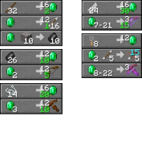
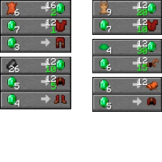

---
navigation:
  title: "Villager Trading"
  icon: "minecraft:emerald"
  position: 1
  parent: lexicon:trading.md
---

# Villager Trading

- There's 5 career levels that can be increased by trading. 
- A full trading bar unlocks the next level of trades. 
- Each profession has its own offers. 
- Professions are assigned to each [*Villager*](../creatures/human-villager.md) based on their job-site block. 
- [*Villagers*](../creatures/human-villager.md) disable an offer after a few trades. But they activate their offers again, up to twice per day. 
- They can have a maximum of 10 trades. Each level unlocks a maximum of 2 trades.

-----

## Economic

- A sold out item gets a price increase when resupplied. If a player does not trade for a higher-priced item, the price is reduced the next time it resupplies. 
- The [*Hero of the Village effect*](../brewing/effects.md#village_hero) temporarily reduces prices for the affected [*Player*](../creatures/human-player.md). 
- All price fluctuations affect only the first item involved in trade. 
- A positive reputation is gained by curing [*Zombie Villagers*](../creatures/undead-zombie_villager.md). 

To cure a [*Zombie Villager*](../creatures/undead-zombie_villager.md), splash it with a [*Splash Potion of Weakness*](../brewing/brewing.md) and then feed it a [*Golden Apple*](../rare/golden_apple.md).

-----

## Armorer

<GameScene zoom={4} interactive={true}>
  <Entity id="minecraft:villager" data="{VillagerData:{profession:armorer}}" />
</GameScene>

__Job site block:__ [*Blast Furnace*](../useables/blast_furnace.md)

-----

## Butcher

<GameScene zoom={4} interactive={true}>
  <Entity id="minecraft:villager" data="{VillagerData:{profession:butcher}}" />
</GameScene>

__Job site block:__ [*Smoker*](../useables/smoker.md)

-----

## Cartographer

<GameScene zoom={4} interactive={true}>
  <Entity id="minecraft:villager" data="{VillagerData:{profession:cartographer}}" />
</GameScene>

__Job site block:__ [*Cartography Table*](../useables/cartography_table.md)

-----

## Fisherman

<GameScene zoom={4} interactive={true}>
  <Entity id="minecraft:villager" data="{VillagerData:{profession:fisherman}}" />
</GameScene>

__Job site block:__ [*Barrel*](../useables/barrel.md)

-----

## Fletcher

<GameScene zoom={4} interactive={true}>
  <Entity id="minecraft:villager" data="{VillagerData:{profession:fletcher}}" />
</GameScene>

__Job site block:__ [*Fletching Table*](../useables/fletching_table.md)

------

## Leatherworker

<GameScene zoom={4} interactive={true}>
  <Entity id="minecraft:villager" data="{VillagerData:{profession:leatherworker}}" />
</GameScene>

__Job site block:__ [*Cauldron*](../brewing/ingredients_equipments.md)

-----

## Librarian

<GameScene zoom={4} interactive={true}>
  <Entity id="minecraft:villager" data="{VillagerData:{profession:librarian}}" />
</GameScene>

__Job site block:__ [*Lectern*](../useables/lectern.md)

-----

## Mason

<GameScene zoom={4} interactive={true}>
  <Entity id="minecraft:villager" data="{VillagerData:{profession:mason}}" />
</GameScene>

__Job site block:__ [*Stonecutter*](../useables/stonecutter.md)

-----

## Shepherd

<GameScene zoom={4} interactive={true}>
  <Entity id="minecraft:villager" data="{VillagerData:{profession:shepherd}}" />
</GameScene>

__Job site block:__ [*Loom*](../useables/loom.md)

-----

## Cleric

<GameScene zoom={4} interactive={true}>
  <Entity id="minecraft:villager" data="{VillagerData:{profession:cleric}}" />
</GameScene>

__Job site block:__ [*Brewing Stand*](../useables/brewing_stand.md)

-----

## Farmer

<GameScene zoom={4} interactive={true}>
  <Entity id="minecraft:villager" data="{VillagerData:{profession:farmer}}" />
</GameScene>

__Job site block:__ [*Composter*](../useables/composter.md)

-----

## Toolsmith

<GameScene zoom={4} interactive={true}>
  <Entity id="minecraft:villager" data="{VillagerData:{profession:toolsmith}}" />
</GameScene>

__Job site block:__ [*Smithing Table*](../useables/smithing_table.md)

-----

## Weaponsmith

<GameScene zoom={4} interactive={true}>
  <Entity id="minecraft:villager" data="{VillagerData:{profession:weaponsmith}}" />
</GameScene>

__Job site block:__ [*Grindstone*](../useables/grindstone.md)

-----

## Nitwit

<GameScene zoom={4} interactive={true}>
  <Entity id="minecraft:villager" data="{VillagerData:{profession:nitwit}}" />
</GameScene>

__Job site block:__ -

-----

## Villager

<GameScene zoom={4} interactive={true}>
  <Entity id="minecraft:villager" />
</GameScene>

Villager without job site block

