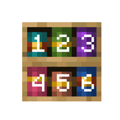

---
navigation:
  title: "Chiseled Bookshelf"
  icon: "minecraft:chiseled_bookshelf"
  parent: lexicon:useable_blocks.md
  item_ids:
    - minecraft:chiseled_bookshelf
---

# Chiseled Bookshelf

<ItemImage id="minecraft:chiseled_bookshelf" />

*Chiseled Bookshelves* can hold up to six *Books*, *Books and Quills*, *Written Books*, *Enchanted Books*, and/or other types of books.

<Recipe id="minecraft:chiseled_bookshelf" />

A redstone [*Comparator*](../redstone/redstone_components.md#comparator) sends a signal (1–6) indicating the last slot interacted with. 

When no slot has been interacted with yet, it outputs 0. 

-----

An [*Observer*](../redstone/redstone_components.md#observer) can detect when a *Book* is added or removed from the bookshelf.

The correspondences between slot and signal power.

