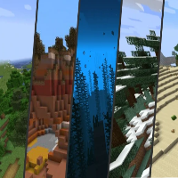

---
navigation:
  title: "Biomes"
  icon: "minecraft:filled_map"
  position: 2
  parent: lexicon:world.md
---

# Biomes

A biome is a region in a world with distinct geographical features, flora, temperatures, humidity ratings, and sky, water, grass and foliage colors. 

Biomes separate every generated world into different environments, such as forests, deserts and taigas.

You can found specific biomes by doing the */locate biome* [*Command*](../commands.md).

