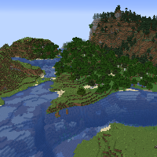
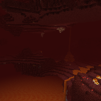
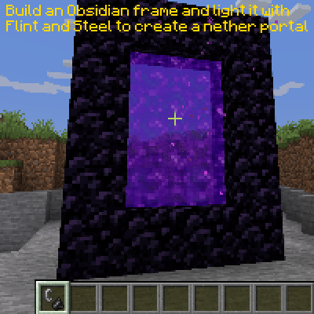
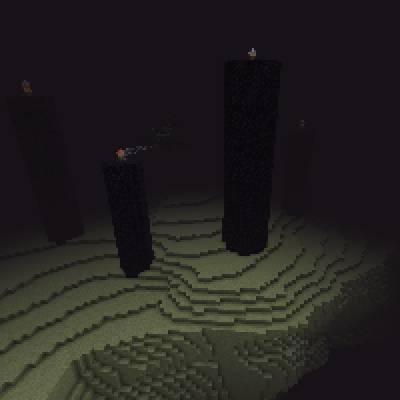
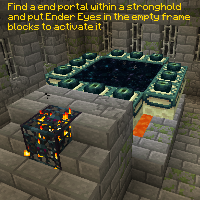

---
navigation:
  title: "Dimensions"
  icon: "minecraft:end_portal_frame"
  position: 1
  parent: lexicon:world.md
---

# Dimensions

Dimensions are accessible realms within a world characterized by a way of generation, biomes and structures, and other things unique to one dimension. 

[*Players*](../creatures/human-player.md) can explore and discover various dimensions in Minecraft, typically through the use of portals. 

The daylight cycle and weather may work differently or not exist in different dimensions, as well as respawn points (such as [*Beds*](../useables/bed.md) and [*Respawn Anchors*](../useables/respawn_anchor.md)) and travel speed. 

Other dimensions can be access with portals.

-----

## The Overworld

The Overworld is the primary dimension in Minecraft. It has a wide variety of unique biomes to explore, and is easily the most diverse of the dimensions.   
 
- large biome variation 
- Lage mob variation 
- oceans of water 
- daylight circle 
- weather 
- 384 block world height

-----

## The Nether

The Nether is a hostile dimension containing huge lava oceans. The ground consists of mainly *Netherrack* and is considered as the underworld of the game. 
 
- chaotic, messy, dangerous, cave-like terrain 
- oceans of lava 
- ceiling of *Bedrock* 
- increased travel speed 
- using a charged [*Respawn Anchor*](../useables/respawn_anchor.md) sets spawn point 
- 256 block world height

 

-----

## The End

The End is a space-like dimension with floating *End Stone* islands. It's a barren environment, but it's the only place where some of the most unique and useful items in the game can be obtained 
 
- direct access to the void 
- home of the [*Ender Dragon*](../creatures/boss-ender_dragon.md) 
- floating islands of *End Stone* 
- big pillars of *Obsidian* 
- 256 block world height

 

