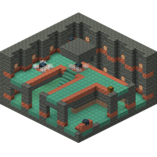
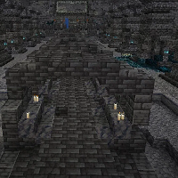

---
navigation:
  title: "Structures"
  icon: "minecraft:compass"
  position: 3
  parent: lexicon:world.md
---

# Structures

Structures are randomly-generated features found throughout your world.
Structures can be found in many biomes in all dimensions. 

Some of these structures can be found by doing the */locate* command.

-----

## Mineshaft

__Locations:__ Overworld (Underground)     
__Rarity:__ Common

-----

## Stronghold

__Locations:__ Overworld (Underground)      
__Rarity:__ Very Rare

-----

## Buried Treasure

__Locations:__ Beach (Underground)      
__Rarity:__ Rare

-----

## Desert Pyramid

__Locations:__ Desert      
__Rarity:__ Uncommon

-----

## Igloo

__Locations:__ Snowy Plains, Snowy Taiga      
__Rarity:__ Rare

-----

## Jungle Temple

__Locations:__ Jungle      
__Rarity:__ Rare

-----

## Pillager Outpost

__Locations:__ Plains, Desert, Savanna, (Snowy-)Taiga      
__Rarity:__ Rare

-----

## Swamp Hut

__Locations:__ Swamp      
__Rarity:__ Rare

-----

## Village

__Locations:__ (Snowy-)Plains, Desert, Savanna, Taiga      
__Rarity:__ Uncommon

-----

## Woodland Mansion

__Locations:__ Dark Forest      
__Rarity:__ Rare

-----

## Ruined Portal

__Locations:__ Overworld, Nether      
__Rarity:__ Common

-----

## Ocean Ruin

__Locations:__ Ocean, Beach      
__Rarity:__ Common

-----

## Trail Ruin

__Locations:__ Jungle, (Snowy-)Taigas, 'Old Growth'-Biomes      
__Rarity:__ Uncommon

-----

## Shipwreck

__Locations:__ Ocean, Beach, Stony Shore, Snowy Beach      
__Rarity:__ Common

-----

## Ocean Monument

__Locations:__ Ocean      
__Rarity:__ Rare

-----

## Nether Fortress

__Locations:__ Nether      
__Rarity:__ Uncommon

-----

## Bastion Remnant

__Locations:__ Nether      
__Rarity:__ Uncommon

-----

## Fossil

__Locations:__ Desert, Swamp, Soul Sand Valley      
__Rarity:__ Rare

-----

## End City

__Locations:__ The End      
__Rarity:__ Rare

-----

## Monster Room (or Dungeon)

__Locations:__ Overworld (Underground)      
__Rarity:__ Common

-----

## Desert Well

__Locations:__ Desert      
__Rarity:__ Uncommon

-----

## Forest Rock

__Locations:__ Old Growth Taiga      
__Rarity:__ Uncommon

-----

## Geode

__Locations:__ Overworld (Underground)      
__Rarity:__ Rare

-----

## Iceberg

__Locations:__ Frozen Ocean      
__Rarity:__ Uncommon

-----

## Trial Chambers

__Locations:__ Overworld (except Deep Dark)      
__Rarity:__ Rare

  

-----

## Ancient City

__Locations:__ Deep Dark      
__Rarity:__ Rare

  

